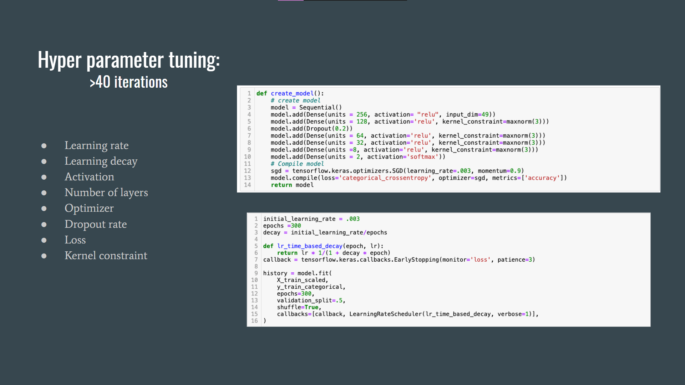
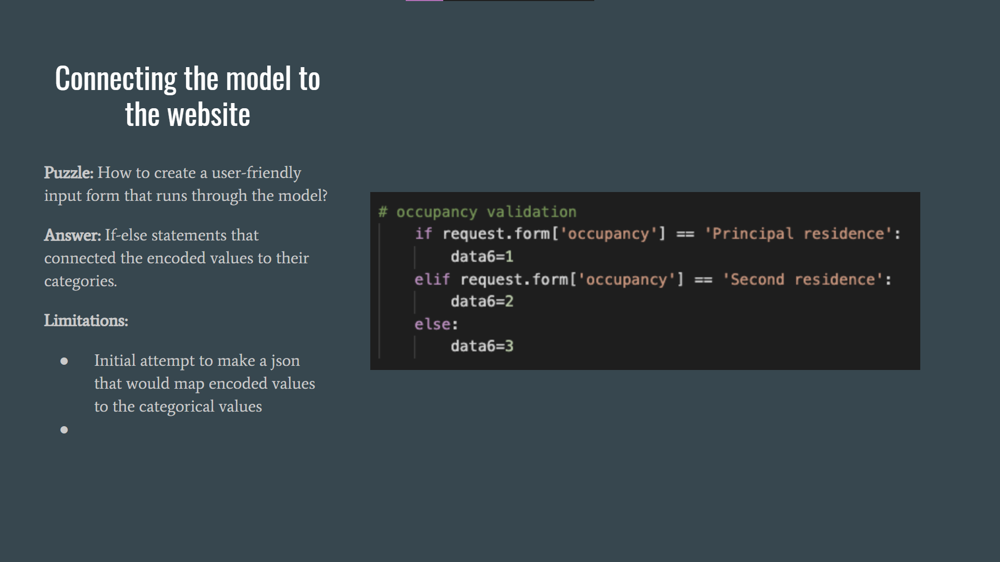

# Mortgage Megalodons

* Team Members: Jordan Shapiro, Laura Jimenez, Kreeti Gulati

[Check Your Mortgage Prediction](https://mortgage-megalodons.herokuapp.com/)

* Objective: Using one million rows of Home Mortgage Disclosure Act data to build a machine learning algorithm to correctly predict future mortgage determinations

# Can historic mortgage application determinations to classify the outcome of future applications?

This project seeks to address that question by using real-world records from the Home Mortgage Disclosure Act. Pulling data from 2018, 2019, and 2020, the cleaned dataset totaled approximately 890,000 rows.

[Dataset](https://ffiec.cfpb.gov/data-browser/data/2020?category=nationwide&races=American%20Indian%20or%20Alaska%20Native,Asian,Black%20or%20African%20American,Native%20Hawaiian%20or%20Other%20Pacific%20Islander,White,2%20or%20more%20minority%20races,Joint,Free%20Form%20Text%20Only,Race%20Not%20Available&actions_taken=1,2,3,4,5,6,7,8)

[Documentation](https://ffiec.cfpb.gov/documentation/2018/lar-data-fields/)

# Summary
Each mortgage is a record of a joint application, no single-person home buyers included. Applicant and co-applicant information captured includes: age, race, sex, income, debt ratio, ethnicity, and credit. Home information captured includes: census tract, state, county, property value, construction method. Loan information  includes: loan amount and purpose.

Using the TensorFlow and sklearn libraries to build the model, we were able to predict the classification of new mortgage applications with 82% accuracy. The model uses five Dense layers, including three hidden layers, and is activated using the tanh function. The optimizer, stochastic gradient descent, gave the best outcome. To prevent overfitting the model uses early stopping and learning rate decay to find the global minimum value. 

Limitations: To clean the data sufficiently for the model, choices had to be made about outliers, joint applications, years, and quantity of data. Ultimately we chose to do join applications, limit the income, and only choose single-family columns. Overall loss for the training and testing values is high, .39. Time was the most bounding constraint, with additional time the model could be further tweaking to reduce the loss.

[PowerPoint](https://docs.google.com/presentation/d/100-ku4TsFcVvGx1w65JAQkhWIHRih7zprUQjE-NRduY/edit)

# Machine Learning Model

# Website Deployment with Heroku 
 

# With More Time
  * Decrease loss with additional hyper parameter tuning
  * Allow anyone to input their information into the form, with fewer features 
  * More data, different data
  * Greater awareness of server and cloud cpu and storage 
